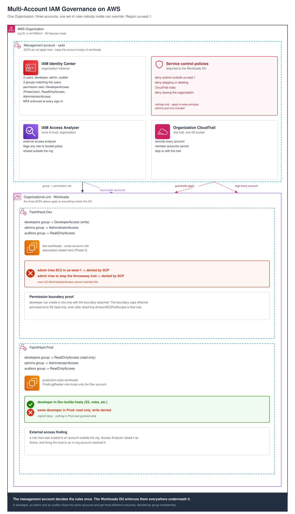

# FashilHack Multi-Account IAM Governance on AWS

A real AWS Organization built end to end across a management account and two workload accounts, with guardrails that survive even an account's own administrator, cross-account role assumption, self-escalation-proof permission boundaries, and tamper-resistant centralized logging.

## Architecture



```
AWS Organization
├── Management account  xarbi
│     IAM Identity Center · 3 Service Control Policies
│     IAM Access Analyzer · Organization CloudTrail
└── OU: Workloads  (the 3 SCPs apply to everything inside)
      ├── FashilHack-Dev    developer builds freely
      └── FashilHack-Prod   developer: read-only, admin: full
```

## Highlights

- ✅ One login per person, a different role per account  verified by testing every user against both accounts and proving the allowed and denied case in each
- ✅ Organization-wide guardrails (Service Control Policies) proven to deny an action to **the account's own administrator**, then proven exempt in exactly one deliberate place: the management account
- ✅ Cross-account role assumption, narrowly scoped to one exact trusted role  proven to work from the correct source and proven to refuse every other source
- ✅ Permission boundaries preventing self-escalation, verified by attaching a broader policy directly to a boundary-capped role and confirming it still stayed capped
- ✅ Organization-wide CloudTrail logging, structurally impossible for any member account to stop, edit, or delete
- ✅ IAM Access Analyzer automatically catching a manufactured external-sharing finding, and confirming it resolved once the trust was corrected
- 🟡 One guardrail edge case (an EC2 action outside the region lock producing no visible console error) documented honestly as an open verification item, not hidden

## What's in this repo

- **[BUILD-LOG.md](BUILD-LOG.md)**  the full technical write-up: every stage of the build, the reasoning behind each decision, the two real issues hit along the way, and exactly how each was diagnosed and resolved.
- **`/diagram`**  the architecture diagram referenced throughout the write-up.
- **`/screenshots`**  evidence referenced throughout the write-up.

## Skills demonstrated

`AWS Organizations` `IAM Identity Center` `Service Control Policies` `Permission Boundaries` `Cross-Account IAM Roles` `AWS STS` `CloudTrail` `IAM Access Analyzer` `Least-Privilege Design`

## Why this exists

Most AWS IAM portfolios stop at one account: users, roles, policies. This one shows the question every real company actually has to answer, what happens once there's more than one account, and how do you stop an account's own administrator from disabling the rules meant to constrain them. It includes the real debugging, not just the parts that worked cleanly on the first attempt.

Full write-up: **[BUILD-LOG.md](BUILD-LOG.md)**
